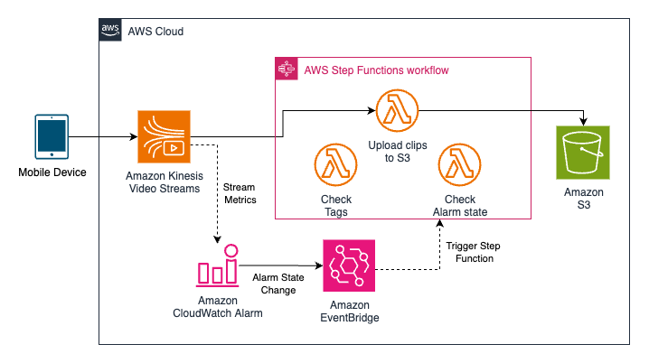
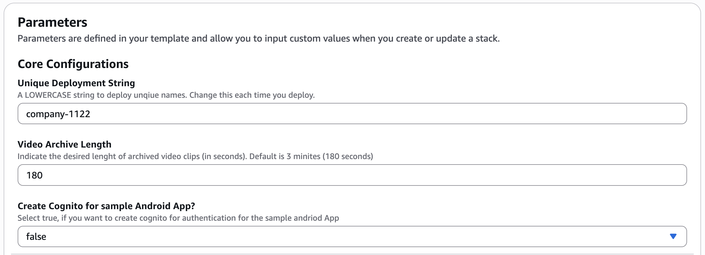
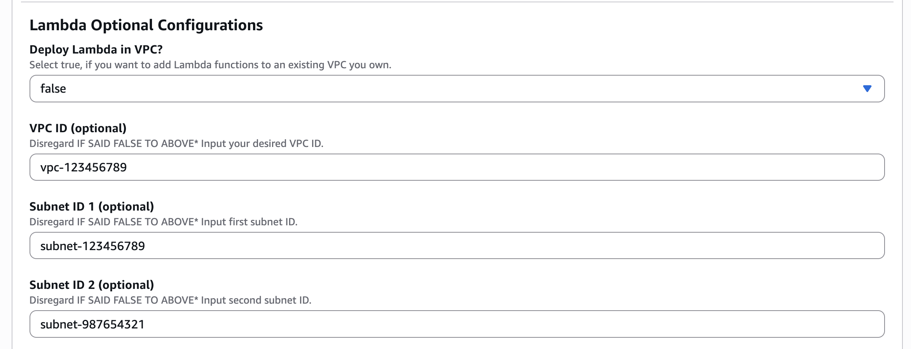
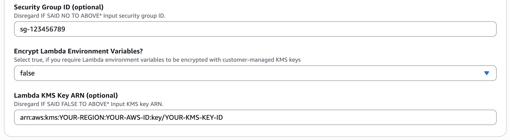

# Recording Video Streams to Amazon S3 Using Amazon Kinesis Video Streams

Read the full AWS blog post here: 

## Solution Architecture

This solution leverages several AWS services to provide seamless video streaming and archiving:

- [**Amazon Kinesis Video Streams (KVS)**](https://aws.amazon.com/kinesis/video-streams/) - Captures and processes video streams from connected devices for real-time and batch analytics.

- [**AWS Lambda**](https://aws.amazon.com/lambda/) - Executes code in response to triggers and processes video fragments for archiving, checking tags and alarm states.

- [**AWS Step Functions**](https://aws.amazon.com/step-functions/) - Orchestrates the workflow of Lambda functions to ensure proper video processing and archiving.

- [**Amazon S3**](https://aws.amazon.com/s3/) - Provides durable storage for archived video clips.

- [**Amazon CloudWatch**](https://aws.amazon.com/cloudwatch/) - Monitors stream metrics and triggers alarms based on defined conditions.

- [**Amazon EventBridge**](https://aws.amazon.com/eventbridge/) - Routes CloudWatch alarm state changes to trigger the Step Functions workflow.

- [**Amazon Cognito**](https://aws.amazon.com/cognito/) (Optional) - Provides user authentication for the Android mobile application.

The workflow begins when a mobile device streams video to KVS. CloudWatch monitors stream metrics, and when conditions are met, an alarm triggers via EventBridge to start the Step Functions workflow. The workflow executes Lambda functions to check tags, alarm state, and upload video clips to S3 for archival storage.

## Deployment Instructions

### 1. Download the CloudFormation Template
Download the CloudFormation YAML template file from the provided source.

### 1. Download the CloudFormation Template

📥 **[Download CloudFormation Template](./kinesis-video-streams-to-amazon-s3-blog-template.yaml)**

### 2. Deploy the CloudFormation Stack
1. Navigate to the [AWS CloudFormation console](https://console.aws.amazon.com/cloudformation/home?region=us-east-1#) in the `us-east-1 (N. Virginia)` region.
2. Click on "Create stack" > "With new resources (standard)".
3. Upload the downloaded template file and click "Next".

### 3. Configure Stack Parameters

 **Stack name**: Enter a name for your stack (e.g., "kvs-to-s3-blog-template").

#### Basic Configurations

These are parameters you need to proivde for successful deployment

1. **Unique Deployment String**: Enter a lowercase string to be added to your stack resources, formatted as `[your-company-name]-[random-4-digits]` (e.g., "amazon-1234").

2. **Video Archive Length**: Select the desired length of archival video clips in seconds. The default is 180 seconds (3 minutes).

3. **Cognito Creation** (Optional): 
   - Select **true** if you plan to use the sample Android application for stream testing.
   - Leave as **false** (default) if you don't need the Android app.

#### Lambda Optional Configurations

These paramaters are optional, if you do not need to modify Lambda VPC and encryption key configurations you can skip this part completely. 

1. **Lambda VPC Deployment** (Optional): 
   - Select **true** if you need to deploy the Lambda functions in a existing VPC.
   - Leave as **false** (default) if you don't need the VPC configuration.

2. **VPC Settings** (If said true in step 1): 
   - Provide the ID of the VPC you plan to utilize. (eg: `vpc-123456789`)

3. **Subnet Configuration** (If said true in step 1): 
   - Provide the ID of the first Subnet you plan to utilize.  (eg: `subnet-123456789`)
   - *Note: this subnet needs to be part of VPC indicated above*

4. **Subnet Configuration 2** (If said true in step 1): 
   - Provide the ID of the second Subnet you plan to utilize.  (eg: `subnet-98765321`)
   - *Note: this subnet needs to be part of VPC indicated above*

5. **Seurity Group Configuration** (If said true in step 1): 
    - Provide the ID of the security group you plan to utilize.  (eg: `sg-123456789`)
   - *Note: this security group needs to be part of VPC indicated above*

6. **Lambda Encyrption Key Configuration** (Optional): 
   - Select **true** if you need to utilize a customer-managed KMS key to encrypt Lambda environment variables.
   - Leave as **false** (default) will utilize servcie managed keys.

7. **Customer-Managed KMS Key** (If said true in step 6): 
    - Provide the ARN of the KMS key you plan to utilize.  (eg: `arn:aws:kms:{YOUR-REGION}:{YOUR-AWS-ID}:key/{YOUR-KMS-KEY-ID}`)

### 4. Complete Stack Creation
1. Click "Next" to proceed to the stack options page.
2. Configure any additional stack options as desired.
3. Click "Next" to proceed to the review page.
4. Review your configuration and scroll to the bottom of the page.
5. Check the acknowledgement box confirming AWS CloudFormation might create IAM resources.
6. Click "Create stack" to launch the deployment.

## Next Steps

After the stack creation completes successfully (this might take a few minutes), click on the "Outputs" tab of your stack in the CloudFormation console.
Here you'll find important information such as:
   - S3 bucket names
   - Lambda function names
   - Other resources created by the stack
   - Connection details or endpoints you may need for integration

## Troubleshooting

If stack creation fails, check the "Events" tab in the CloudFormation console for error messages that can help diagnose the issue.

## Solution Walkthrough
Head back to the [Recording mobile video to Amazon S3 using Amazon Kinesis Video Streams](https://aws.amazon.com/media) AWS blog for walkthrough of the solution, future considerations and clean up. 

## Security

See [CONTRIBUTING](CONTRIBUTING.md#security-issue-notifications) for more information.

## License

This library is licensed under the MIT-0 License. See the LICENSE file.

